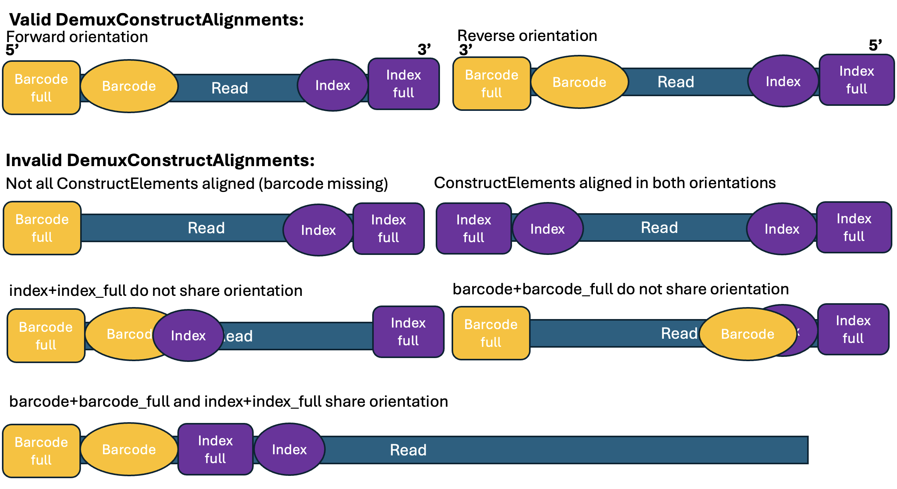

# speeddemONT

Keiler Collier, writing from probably-hell

## Purpose

A `Python` program designed to demultiplex ONT-barcoded ddRADseq data.
Currently being developed for [Oikos](https://oikosgenomics.org)'s genomics low-cost parentage analyses.

## Quickstart

The minimal example below will write all demuxxed fastq files to `speeddemONT_out` in your working directory.

```
speeddemONT -f <input.fq.fz> -d <input_demux_construct_file.tsv> -fa .9 -b 9
```

### Options

| Option | Default | Data type | Description |
| -- | -- | -- | -- |
| `-h`, `--help` | `FALSE` | Flag | Print a help message and exit. |
| `-f`, `--fastq` | `null` | String | Path to the input FASTQ file to be demultiplexed. Mandatory. |
| `-d`, `--demux` | `null` | String | Path to the demux construct TSV file. Mandatory. |
| `-b`, `--buffer` | `0` | Int | The integer number of base pairs outside of the long element the short element can align to. Defaults to 0 (internal matching only). Mandatory. |
| `-p`, `--prefix` | `speeddemONT_out` | String | Output directory prefix. Demultiplexed FASTQ files will be written to this directory. |
| `-fa`, `--fuzzy_aln_percent` | `0.9` | Float | The minimum percent identity (0.0-1.0) needed to fuzzy-match a full index or barcode to a sequence. Used for `index_full` and `barcode_full` alignments. |
| `-ea`, `--exact_aln_percent` | `1.0` | Float | The minimum percent identity (0.0-1.0) needed to exact-match a short index or barcode to a sequence. Used for `index` and `barcode` alignments. |

## Inputs

### Fastq file

This pipeline is intended for use on longread data of variable length.
Contrary to the name, it will work on both PacBio and ONT as well, but if you have Illumina data, you should use [Stacks](https://catchenlab.life.illinois.edu/stacks/).

That is a more mature and better-supported program.

### Demux construct file

The demux construct file is a 5-column `tsv` describing the four `ConstructElements` (theoretically) present in your readfile.
A minimal example is shown below, where ellipses (`...`) indicate sequences truncated for readability:

```
sample_id	index_full	index	barcode_full	barcode
R10N00251	CAA...AATT	CGTGAT	AAT...GCA	ACACCT
R20N00088	CAA...ATTT	CGTGAT	AAT...GCA	ACAGCA
```

#### Common errors in the demux construct file

The demux construct file currently *must* be input with exactly the same header and structure as shown below.
`speeddemONT` will throw errors if:

- The header is malformed
- The `index` or `barcode` columns are not 6-9 bp long
- Columns are out of order
- Nonstandard nucelotides appear in the sequence columns
    - Ie, all characters should be `ATCG`

#### Column interpretation

`@Xander Velkeneers` - your assistance is needed.

1. I would like to know any further information on how the `index_full`/`index`/`barcode_full`/`barcode` information is decided.

The differences between the 'short' and 'long' indices are easy - one is an exact match, the other is fuzzy.
However, for a given length (eg, `barcode` and `index`, or `barcode_full` and `index_full`), there seems to be differences except their names.
Do they have anything to do with which restriction enzymes are used?

2. It would also be useful to have a range of sizes for the `index_full`/`barcode_full` columns.

| Column | Interpretation |
| -- | -- |
| `sample_id` | The bins the reads need to be demultiplexed into. |
| `index_full` | A `ConstructElement`. A long, ONT-specific index. Expected to contain mismatches; alignment stringency controlled with `--fuzzy_aln_percent`. |
| `index` | A `ConstructElement`. A short (6-9) bp sequence which must be exactly (or *close* to exactly) matched. Alignment stringency controlled with `--exact_aln_percent`. |
| `barcode_full` | A `ConstructElement`. A long, ONT-specific index. Expected to contain mismatches; alignment stringency controlled with `--fuzzy_aln_percent`. |
| `barcode` | A `ConstructElement`. A short (6-9) bp sequence which must be exactly (or *close* to exactly) matched. Alignment stringency controlled with `--exact_aln_percent`. |

## Behavior

`speeddemONT` implements several layers of filtering to both remove reads with malformed demultiplex constructs and sort correctly-sequenced reads into `sample_id` bins.

This is a high-level description of the filtering steps used to bin a single read.

### 1. Remove Reads with invalid `DemuxConstructAlignment`

`ConstructElements` are the columns in `DemuxConstruct` file.
The `DemuxConstructAlignment` is the set of their alignments to the Read, and the first layer of filtering.
Since each of the 4 Elements can align in a **forward** ($5\rightarrow 3$) and **reverse** ($3\rightarrow 5$) orientation, we have 8 alignments:

$$4 \text{\ ConstructElements} \times 2 \text{\ Orientations } = 8 \text{\ Alignments}$$

These alignments should make sense relative to one another.
We score a `DemuxConstructAlignment` as **invalid** (and remove the read) under the following circumstances:

- A `ConstructElement` does not align
- A (big) `ConstructElement` aligns in both orientations
  - We allow small `ConstructElements` to align in both directions, because this can happen by chance. 
- Orientations of `ConstructElementPairs` do not make sense relative to each other
  - See table below

| Type | Same orientation as | Opposite orientation as | Alignment strictness |
| -- | -- | -- | -- |
| `index_full` | `index` | `barcode,barcode_full` | Fuzzy |
| `index` | `index_full` | `barcode,barcode_full` | Exact |
| `barcode_full` | `barcode` | `index,index_full` | Fuzzy |
| `barcode` | `barcode_full` | `index,index_full` | Exact |

### Figure 1. Cartoon depiction of valid and invalid `DemuxConstructAlignments`



### 2. Remove Reads where short `ConstructElements` are not found near long ones

Short `ConstructElements` canonically fit inside of their long counterparts.
The user can additionally define a 'buffer zone' of $n$ base pairs off either side of the long barcode with the `-b` argument.
Reads where both of the shot `ConstructElements` are not found within the buff zone of the long `ConstructElements`.

@Xander please help by telling me if that makes sense from a wet-lab perspective

FIXME : @Keiler Collier An image would make this way clearer

### 3. Remove concatemers

FIXME : @Keiler Collier An image would make this way clearer

## Dependencies

### Python Version

- **Python 3.9.6** (tested version)

### Required Libraries

#### Standard Library (built-in)

- `argparse` - Command-line argument parsing
- `os` / `path` - Operating system interface and path manipulation
- `gzip` - Gzip file compression/decompression
- `subprocess` - Process management for external compression tools
- `io` - Text I/O wrapper for subprocess pipes
- `shutil` - Utility functions (used for finding compression tools)
- `mimetypes` - MIME type guessing for file detection
- `functools` - Higher-order functions (partial function application)

#### Third-Party Libraries

- **BioPython** (`Bio`) - Biological sequence analysis
  - `Bio.SeqIO` - Sequence file input/output
  - `Bio.Restriction` - Restriction enzyme data
  - `Bio.Align` - Sequence alignment
  - `Bio.Seq` - Sequence objects
  - `Bio.SeqRecord` - Sequence record objects
- **numpy** - Numerical computing (used for NaN values and array operations)
- **pandas** - Data manipulation and analysis (used for TSV file parsing)
- **edlib**

### Installation
Install the required third-party libraries using pip:
```bash
pip install biopython numpy pandas
```

Or using conda:
```bash
conda install biopython numpy pandas
```

### Optional Dependencies

- **pigz** - Parallel gzip compression tool (used if available, otherwise falls back to `gzip`)

## Speed Boost and profiling

On 12 Dec 2025, naively implemented and using the following commands, `speeddemONT` had the following speeds:

```

```

| Command | Machine | Real time | User time |
| -- | -- | -- | -- | -- |
| `time ./speeddemONT -f tests/data/ONT_test_0001percent.fq.gz -d tests/data/ddRAD_demux_construct.tsv` | Nietzsche | 42.105 | 40.28s |


We use [`cprofilev`](https://github.com/ymichael/cprofilev) to figure out what's wrong with this.

```
python -m cprofilev -f speeddemONT_cProfile.tsv
```